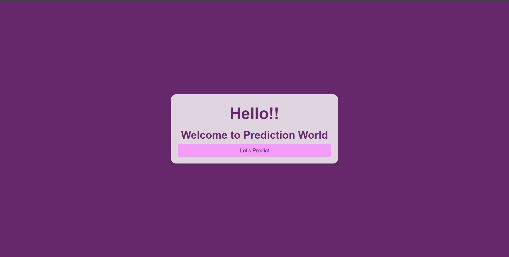
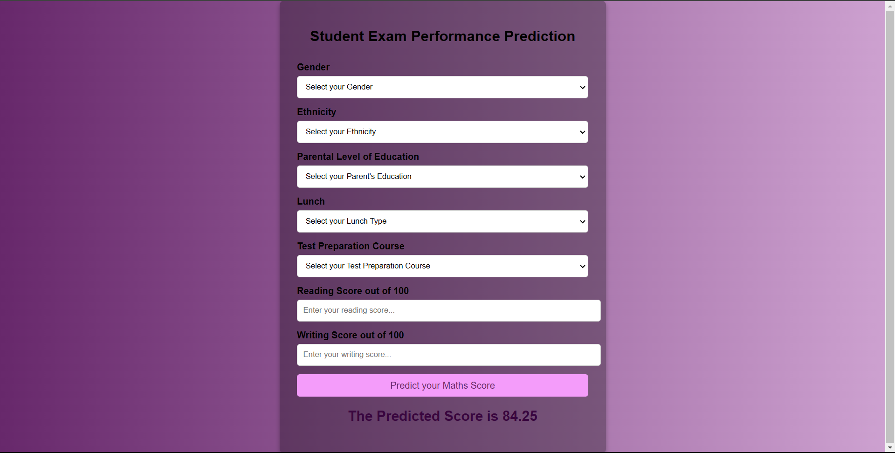

# Student Performance Prediction

## Introduction

This project aims to predict the performance of students based on various demographic and educational factors. The goal is to use regression analysis to predict student scores in mathematics.

## About the Data

The dataset used for this project includes the following variables:

### Independent Variables:

- **gender**: Gender of the student (male/female)
- **race_ethnicity**: Ethnic group of the student
- **parental_level_of_education**: Highest education level of the student's parents
- **lunch**: Type of lunch (standard/free/reduced)
- **test_preparation_course**: Completion status of the test preparation course (completed/none)
- **math_score**: Student's score in mathematics
- **reading_score**: Student's score in reading
- **writing_score**: Student's score in writing

### Target Variable:

- **Overall performance score**: A combined metric based on math, reading, and writing scores

## Dataset Source

The dataset can be accessed from [Kaggle](https://www.kaggle.com/datasets).

## Observations

It is observed that the categorical variables 'gender', 'race_ethnicity', 'parental_level_of_education', 'lunch', and 'test_preparation_course' play significant roles in predicting student performance. 

### Example Data

| gender | race_ethnicity | parental_level_of_education | lunch       | test_preparation_course | math_score | reading_score | writing_score |
|--------|----------------|-----------------------------|-------------|-------------------------|------------|---------------|---------------|
| female | group B        | bachelor's degree           | standard    | none                    | 72         | 72            | 74            |
| female | group C        | some college                | standard    | completed               | 69         | 90            | 88            |
| female | group B        | master's degree             | standard    | none                    | 90         | 95            | 93            |
| male   | group A        | associate's degree          | free/reduced| none                    | 47         | 57            | 44            |
| male   | group C        | some college                | standard    | none                    | 76         | 78            | 75            |

## Approach for the Project

### Data Ingestion

- In the Data Ingestion phase, the data is first read as a CSV file.
- Then the data is split into training and testing sets and saved as CSV files.

### Data Transformation

- In this phase, a `ColumnTransformer` pipeline is created.
- For numeric variables, first, `SimpleImputer` is applied with the median strategy, then standard scaling is performed on the numeric data.
- For categorical variables, `SimpleImputer` is applied with the most frequent strategy, then ordinal encoding is performed, and after this, the data is scaled with `StandardScaler`.
- This preprocessor is saved as a pickle file.

### Model Training

- In this phase, various regression models are tested. The performance of these models is evaluated based on their R2 scores.
- The following models were tested:
  - Ridge: R2 Score = 0.880593
  - Linear Regression: R2 Score = 0.880433
  - CatBoost Regressor: R2 Score = 0.851632
  - AdaBoost Regressor: R2 Score = 0.848774
  - XGBoost Regressor: R2 Score = 0.827797
  - Lasso: R2 Score = 0.825320
  - K-Neighbors Regressor: R2 Score = 0.784030
  - Decision Tree: R2 Score = 0.755628
- Based on the R2 scores, Ridge and Linear Regression models performed the best.
- Hyperparameter tuning is performed on the best models.
- A final `VotingRegressor` is created, which combines the predictions of Ridge, Linear Regression, and CatBoost models.
- This final model is saved as a pickle file.

### Prediction Pipeline

- This pipeline converts given data into a dataframe and has various functions to load pickle files and predict the final results in Python.

### Flask App Creation

- A Flask app is created with a user interface to predict the student performance scores inside a web application.
]

## Screenshot of UI

